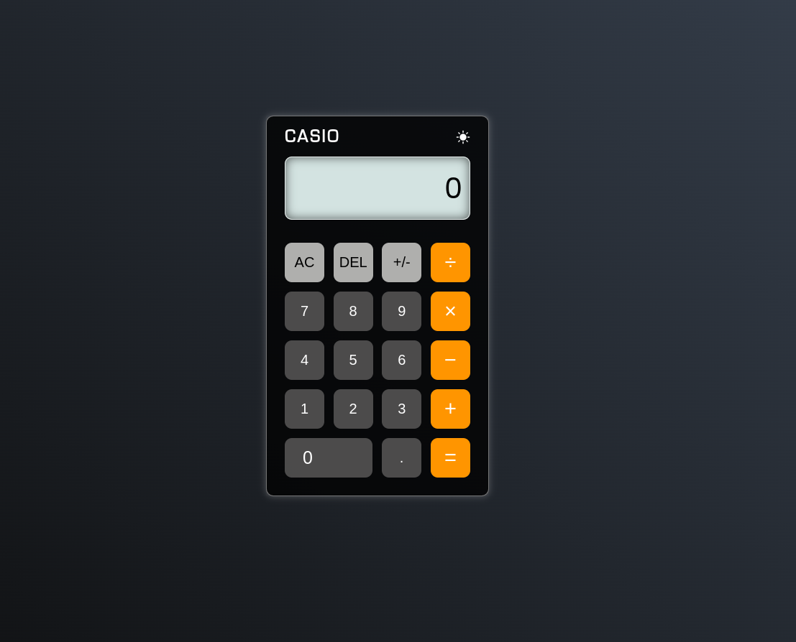

# Calculator 
A web based calculator that can perform calculations in decimals.

## [Live Preview](https://malihassandev.github.io/Calculator/)

## Features
- Ability to calculate decimals expressions.
- Ability to Display Syntax Error on invalid input.
- Plays sound on each number Input

## Tech Stack
- Html 
- Javascript
- Css
## Outcome
- Improved usage of Regular expression for string parsing.
- Learned theme switching using css variables.
## Navigation
- My next project [Youtube Homepage](https://github.com/MAliHassanDev/YouTube-Website)
- My previous project [Rock Paper Scissors](https://github.com/MAliHassanDev/Rock-Papper-Scissors)
